# Distributed Visual Navigation Hint System

This ROS 2 project implements a distributed visual navigation system. It analyzes a video stream in real-time, estimates geometric object depths, tracks motion via optical flow, and calculates navigational decisions to execute physical avoidance actions safely. 

It is divided into 8 distinct ROS 2 nodes alongside a custom interface package.

## Project Structure
* `camera_stream`: Streams the video frames over `/camera_frames`
* `object_detection`: Detects physical obstacles using YOLO and publishes bounding boxes to `/object_data`
* `depth_estimation`: Calculates geometrical depth for each detected obstacle using real object height assumptions, outputting to `/depth_data`
* `roi_feature`: Extracts region specific features (centroids and averages) from the video stream onto `/roi_features`
* `motion_tracking`: Tracks pixel shift magnitudes comparing frame iterations and publishes to `/motion_data`
* `visual_odometry`: Calculates camera motion direction (`FORWARD`/`LEFT`/`RIGHT`/`BACKWARD`) via Lucas-Kanade optical flow, publishing `/camera_motion` and providing the `/estimate_motion` service.
* `navigation_decision`: Synthesizes data recursively, providing Action Client commands to avoid obstacles.
* `action_execution`: Implements the ROS 2 Action Server representing the physical motors executing `/navigate_action` targets.
* `custom_nav_interfaces`: Holds the Action (`Navigate.action`) and Service (`EstimateMotion.srv`) definitions.

---

## Graph of The Desired Structure


## Building the Workspace

1. Open your terminal in the root of the workspace (e.g. `task-4`).
2. Make sure you have sourced your ROS 2 environment:
   ```bash
   source /opt/ros/humble/setup.bash
   ```
3. Install required Python packages (OpenCV, Ultralytics, NumPy):
   ```bash
   pip install opencv-python ultralytics numpy
   ```
4. Build the packages (ignoring any test warnings):
   ```bash
   colcon build --symlink-install
   ```
5. Source the newly built workspace:
   ```bash
   source install/setup.bash
   ```

---

## How to Run the Nodes

Because of the distributed architecture, it's recommended to run each node in its own terminal or orchestrate them using a ROS launch file. 

To run each independently, **remember to source the workspace first in every new terminal**:
```bash
source install/setup.bash
```

**1. Camera Stream** (Run this first)
```bash
ros2 run camera_stream camera_stream_node
```

**2. Custom Action Executer** (Wait for commands)
```bash
ros2 run action_execution action_execution_node
```

**3. Object Detection**
```bash
ros2 run object_detection object_detection_node
```

**4. Depth Estimation**
```bash
ros2 run depth_estimation depth_estimation_node
```

**5. ROI Feature Extraction**
```bash
ros2 run roi_feature roi_feature_node
```

**6. Motion Tracking**
```bash
ros2 run motion_tracking motion_node
```

**7. Visual Odometry**
```bash
ros2 run visual_odometry visual_odometry_node
```

**8. Navigation Decision Maker** (Run this last to connect to the Action Server and process data streams)
```bash
ros2 run navigation_decision navigation_decision_node
```

### Parameter Tuning
Some nodes expose internal parameters that can be tuned. For example:
- `yolov8n.pt` confidence: `ros2 param set /object_detection_node confidence_threshold 0.6`
- Depth geometric focal length: `ros2 param set /depth_estimation_node focal_length_px 900.0`
- ROI size: `ros2 param set /roi_feature_node roi_size 10`
